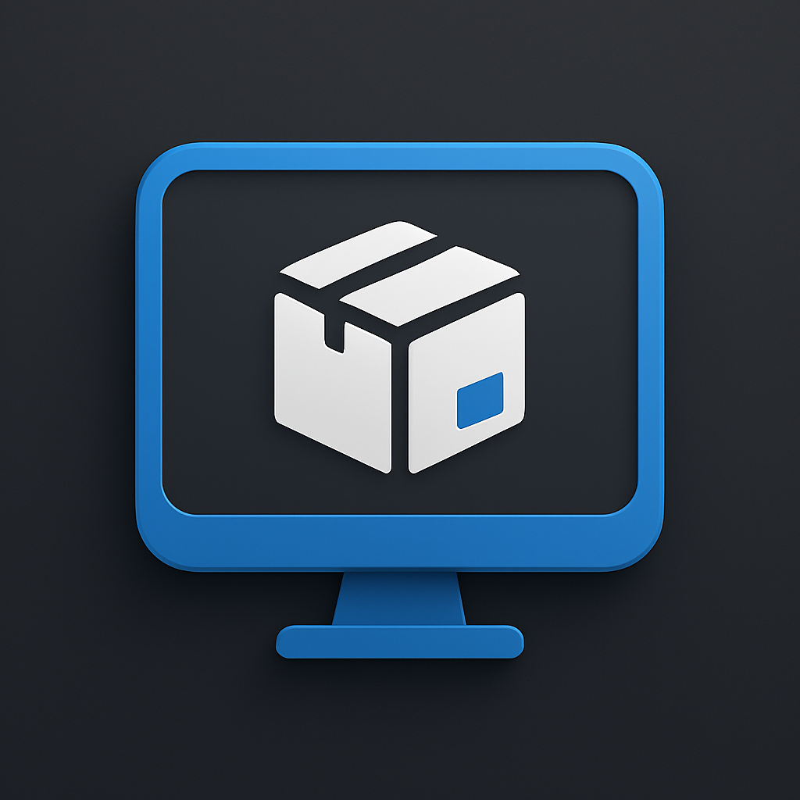

# AppVault

A modern, user-friendly Linux application manager with a sleek dark theme interface. AppVault provides a centralized way to view, launch, and manage applications from multiple package sources including APT/DPKG packages, Flatpak, and Snap.



## Features

- 🎨 **Modern Dark UI** - Clean and intuitive interface with dark theme
- 📦 **Multi-Source Support** - Manage APT/DPKG, Flatpak, and Snap packages
- 🔍 **Smart Search** - Quickly find applications by name
- 🚀 **Quick Launch** - Launch applications directly from the interface
- 🗑️ **Safe Removal** - Delete applications with confirmation dialogs
- 📊 **Categorization** - Separate tabs for Desktop Apps, CLI Apps, Flatpak, and Snap
- 🎯 **Application Details** - View package information, icons, and categories
- ⌨️ **Keyboard Shortcuts** - Efficient navigation with Ctrl+F and F5

## Screenshots

### Main Interface
The main window shows all installed applications organized by tabs:
- **Desktop Apps** - GUI applications with .desktop files
- **CLI Apps** - Command-line tools and utilities
- **Flatpak Apps** - Applications installed via Flatpak
- **Snap Apps** - Applications installed via Snap

### Features Showcase
- Real-time application scanning
- Icon display for recognized applications
- One-click launch and removal
- Search filtering across all package sources

## Requirements

- Python 3.9 or higher
- PySide6 (Qt for Python)
- Linux system with:
  - APT/DPKG package manager (Debian/Ubuntu-based)
  - Optional: Flatpak
  - Optional: Snap

## Installation

### Quick Install (Recommended)

1. Clone the repository:
```bash
git clone https://github.com/lsupwp/AppVault.git
cd AppVault
```

2. Create and activate virtual environment:
```bash
python3 -m venv .appvault_env
source .appvault_env/bin/activate
```

3. Install dependencies:
```bash
pip install -r requirements.txt
```

4. Build and install system-wide:
```bash
python3 build_appvault.py
```

This will:
- Build a standalone executable
- Install to `/opt/appvault/`
- Create a desktop entry
- Add `appvault` command to PATH

### Manual Installation

If you prefer to run from source:

1. Install dependencies:
```bash
pip install -r requirements.txt
```

2. Run directly:
```bash
python3 app.py
```

## Usage

### Running AppVault

After installation, you can launch AppVault in three ways:

1. **From Application Menu**
   - Search for "AppVault" in your application launcher
   - Click to launch

2. **From Terminal**
   ```bash
   appvault
   ```

3. **From Source**
   ```bash
   python3 app.py
   ```

### Managing Applications

#### Searching
- Use the search box at the top to filter applications by name
- Press `Ctrl+F` to focus the search box

#### Launching
1. Select an application from any tab
2. Click the "Launch" button or double-click the application

#### Removing
1. Select an application from any tab
2. Click the "Delete" button
3. Confirm the removal in the dialog
4. The application will be uninstalled with automatic cleanup

#### Refreshing
- Click the "Refresh" button to rescan all applications
- Press `F5` for quick refresh

## Keyboard Shortcuts

| Shortcut | Action |
|----------|--------|
| `Ctrl+F` | Focus search box |
| `F5` | Refresh application list |

## Building from Source

### Build Executable

To create a standalone executable:

```bash
python3 build_appvault.py
```

The executable will be created in `dist/AppVault` and automatically installed system-wide.

### Build Options

The build script will:
1. Check and install PyInstaller if needed
2. Clean previous builds
3. Verify dependencies (PySide6, pyqtdarktheme)
4. Build using PyInstaller with all required resources
5. Install to `/opt/appvault/`
6. Create desktop entry at `/usr/share/applications/appvault.desktop`
7. Create symlink at `/usr/local/bin/appvault`

## Uninstallation

To remove AppVault from your system:

```bash
sudo python3 uninstall_appvault.py
```

This will remove:
- Application files from `/opt/appvault/`
- Desktop entry
- Icon file
- Symlink from PATH

## Project Structure

```
AppVault/
├── app.py                      # Main entry point
├── gui.py                      # GUI implementation
├── build_appvault.py           # Build and installation script
├── uninstall_appvault.py       # Uninstallation script
├── requirements.txt            # Python dependencies
├── core/                       # Core functionality
│   ├── __init__.py
│   ├── models.py              # Data models
│   ├── package_scanner.py     # APT/DPKG scanner
│   ├── flatpak_scanner.py     # Flatpak integration
│   └── snap_scanner.py        # Snap integration
└── public/
    └── images/                # Application icons and assets
        └── AppVault_Logo.png
```

## Development

### Setting Up Development Environment

1. Clone the repository:
```bash
git clone https://github.com/lsupwp/AppVault.git
cd AppVault
```

2. Create virtual environment:
```bash
python3 -m venv .appvault_env
source .appvault_env/bin/activate
```

3. Install dependencies:
```bash
pip install -r requirements.txt
```

4. Run in development mode:
```bash
python3 app.py
```

### Dependencies

- **PySide6** - Qt bindings for Python (GUI framework)
- **pyqtdarktheme** - Dark theme support
- **PyInstaller** - Creating standalone executables

## Technical Details

### Package Detection

AppVault scans multiple sources:

1. **APT/DPKG Packages**
   - Reads `/var/lib/dpkg/status` for installed packages
   - Searches `/usr/share/applications/` for .desktop files
   - Categorizes as Desktop or CLI applications

2. **Flatpak Applications**
   - Uses `flatpak list` command
   - Retrieves application metadata
   - Supports both user and system installations

3. **Snap Packages**
   - Uses `snap list` command
   - Parses snap information and metadata

### Application Launch

- Desktop apps: Parses and executes `Exec=` field from .desktop files
- Flatpak apps: Uses `flatpak run <app-id>`
- Snap apps: Uses `snap run <snap-name>`

### Application Removal

- APT packages: Uses `pkexec apt-get autoremove --purge`
- Flatpak: Uses `flatpak uninstall --delete-data`
- Snap: Uses `pkexec snap remove --purge`

All removals require user confirmation and proper authorization.

## Troubleshooting

### AppVault doesn't show all applications
- Ensure you have permissions to read package databases
- Try refreshing with F5
- Check if Flatpak/Snap are installed if those tabs are empty

### Cannot launch applications
- Verify the application is properly installed
- Check if .desktop files exist for APT packages
- Ensure Flatpak/Snap services are running

### Build fails
- Ensure all dependencies are installed: `pip install -r requirements.txt`
- Check Python version is 3.9 or higher: `python3 --version`
- Make sure you have write permissions for installation directories

## Contributing

Contributions are welcome! Please feel free to submit a Pull Request.

## License

This project is open source and available under the MIT License.

## Credits

Developed by [lsupwp](https://github.com/lsupwp)

## Support

If you encounter any issues or have questions:
- Open an issue on [GitHub](https://github.com/lsupwp/AppVault/issues)
- Check existing issues for solutions

---

**Note**: AppVault requires appropriate permissions to manage system packages. Some operations (like removing packages) will request administrator privileges via `pkexec`.
